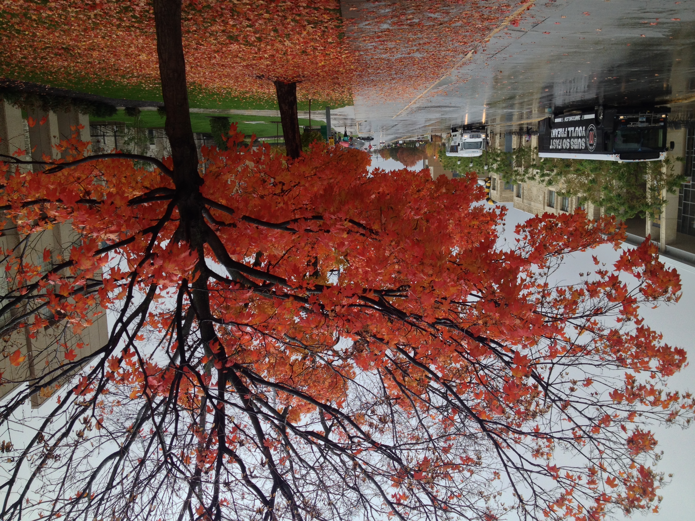

# img-swap
[OSX release](https://github.com/quasi-coherent/img-swap/releases)

## usage
Full list of options:

``` bash
img-swap

Usage: img-swap --first-path ARG --second-path ARG --first-prob ARG
                --second-prob ARG

Available options:
  -h,--help                Show this help text
  --first-path ARG         Path the the first image.
  --second-path ARG        Path the the second image.
  --first-prob ARG         Integer in the range 1-99 representing the
                           probability of choosing a row from the first image.
  --second-prob ARG        Integer in the range 1-99 representing the
                           probability of choosing a row from the second image.
```

## examples





